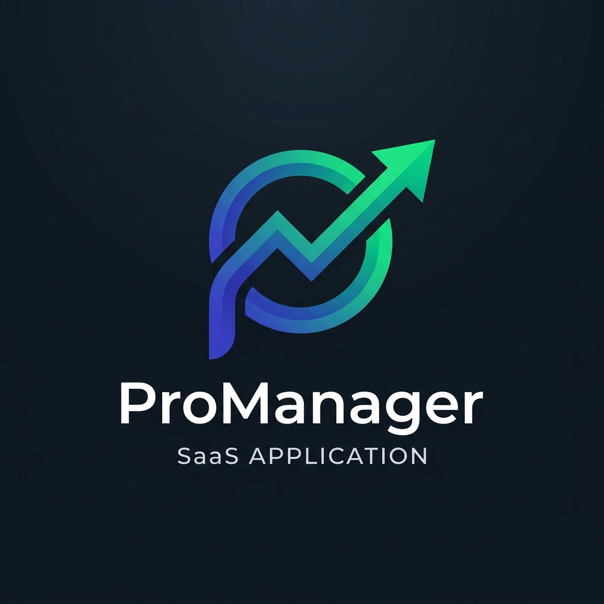
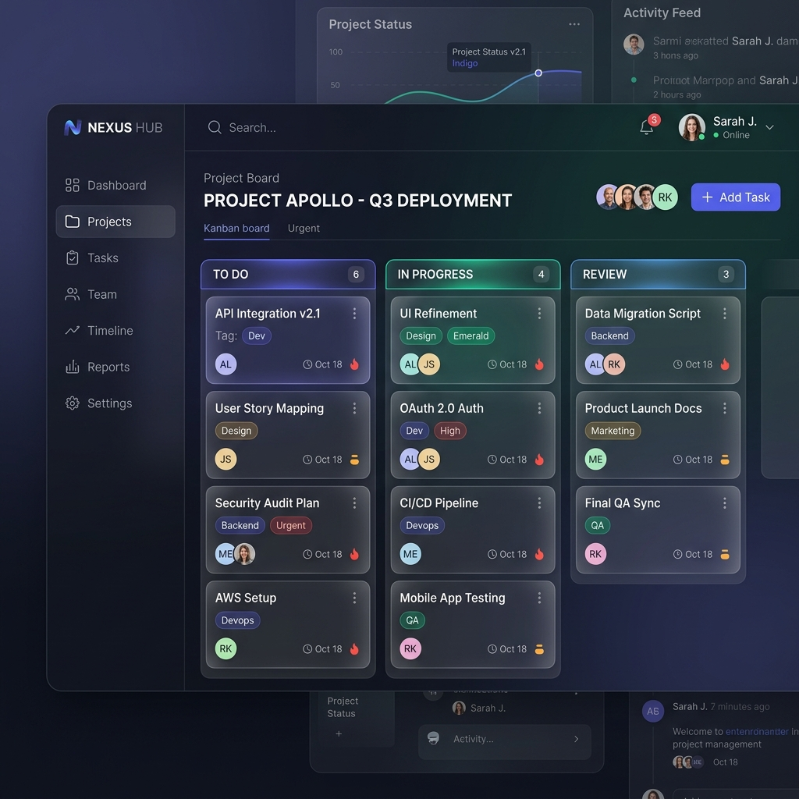

<div align="center">
  
  
  # ProManager 🚀
  
  **The Enterprise-Grade Collaborative Project Management Platform**
  
  [](https://opensource.org/licenses/MIT)
  [](https://react.dev)
  [](https://nextjs.org/)
  [](https://nodejs.org/)
  [](https://www.prisma.io/)
  [](https://www.docker.com/)

  [View Live Demo](#demo) • [Read Architecture](docs/Architecture.md) • [Report Bug](.github/ISSUE_TEMPLATE/bug_report.md) • [Request Feature](.github/ISSUE_TEMPLATE/feature_request.md)
</div>

<br />

ProManager is a modern, fast, and feature-rich open-source project management application designed for agile teams. Built from the ground up for scale, it integrates real-time collaboration, an embedded AI Assistant, interactive Gantt charts, and advanced resource management.



---

## ✨ Features

- **Interactive Kanban Boards:** Drag-and-drop task management with customizable columns and real-time Socket.IO updates.
- **Gantt Charts & Timelines:** Visualize project dependencies, critical paths, and project durations.
- **Embedded AI Assistant (ProAI):** Generate task summaries, analyze project risks, and automatically route issues.
- **Time Tracking & Timesheets:** Track billable hours and view resource allocation heatmaps.
- **Advanced Resource Management:** Prevent team burnout with visual capacity planning.
- **GitHub Integration:** Automatically link PRs and commits to tasks via Webhooks.
- **Enterprise Security:** XSS sanitization, Helmet headers, robust Rate Limiting, and unified Winston logging.

---

## 🛠️ Tech Stack

### Frontend
- **Framework:** Next.js 15 (App Router) & React 19
- **Styling:** Tailwind CSS v4 & `shadcn/ui`
- **State Management:** Zustand (Global) & TanStack Query v5 (Server State)
- **Animation:** Framer Motion
- **Forms:** React Hook Form + Zod validation

### Backend
- **Core:** Node.js + Express v5
- **Language:** TypeScript
- **Database:** PostgreSQL / MySQL (via Prisma ORM)
- **Real-time:** Socket.IO v4
- **Security:** Helmet, `xss` Middleware, `express-rate-limit`
- **Logging:** Winston + Morgan

---

## 🚀 Quick Start (Demo Mode)

Want to see it in action without configuring a database?

1. Clone the repository:
   ```bash
   git clone https://github.com/promanager/promanager.git
   cd promanager
   ```
2. Start the stack via Docker:
   ```bash
   docker-compose up -d
   ```
3. Open `http://localhost:3000` and click **"Try Demo Workspace"** on the login page!

---

## 💻 Manual Development Setup

### Prerequisites
- Node.js >= 20
- MySQL or PostgreSQL database

### 1. Backend Setup
```bash
cd backend
npm install
cp .env.example .env     # Update with your DB credentials
npm run prisma:generate
npm run prisma:migrate
npm run seed             # (Optional) Load sample data
npm run dev
```
### 2. Frontend Setup
```bash
cd frontend-v2
npm install --legacy-peer-deps
cp .env.example .env.local
npm run dev
```
The app will be running at `http://localhost:3000`.

---

## 🏗️ Architecture

Read the full [Architecture & System Design Documentation](docs/Architecture.md) to explore the system's database schema, authentication flow, and real-time infrastructure.

---

## 🤝 Contributing

We welcome contributions from the community! Please read our [Contributing Guidelines](CONTRIBUTING.md) and [Code of Conduct](CODE_OF_CONDUCT.md) before submitting pull requests.

## 📄 License

This project is licensed under the MIT License - see the [LICENSE](LICENSE) file for details.
