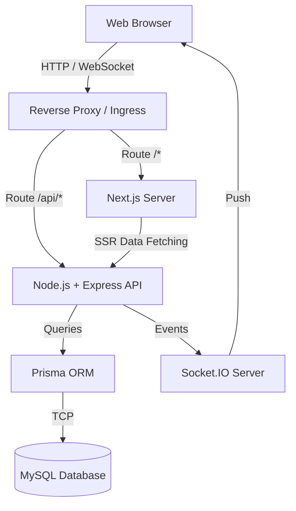
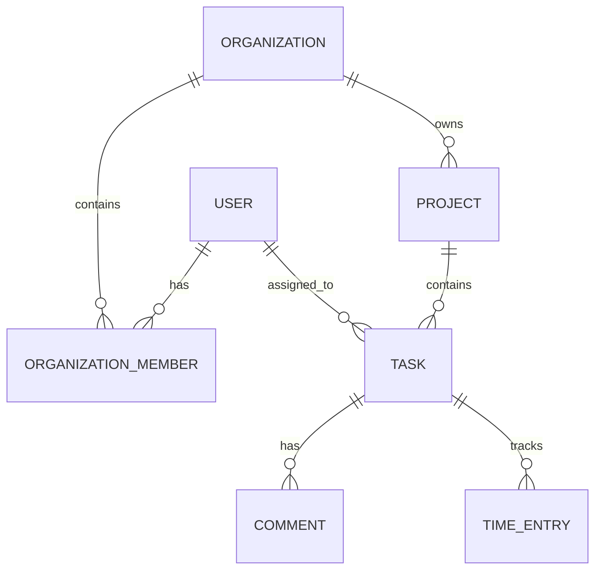
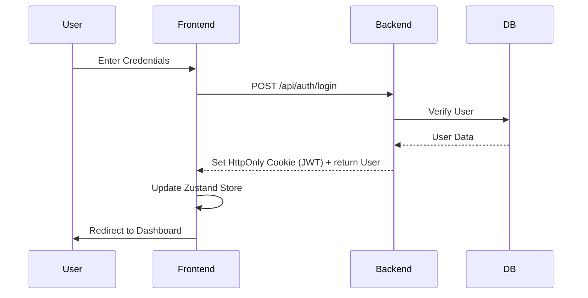
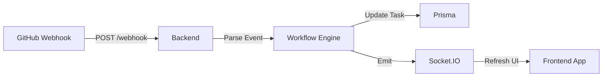

# Architecture & System Design

ProManager is built with a decoupled architecture, separating the Next.js frontend from the Express.js API backend, allowing each to scale independently.

## System Architecture

## Database ERD (Simplified)

## Authentication Flow (JWT)

## Automated Workflows & Integrations

